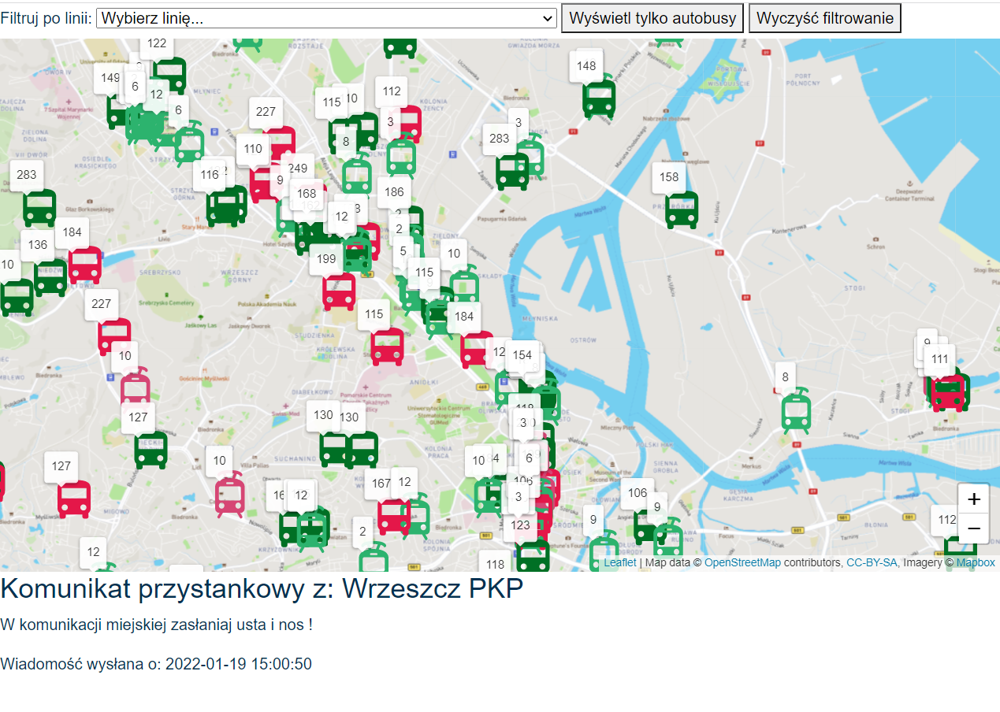
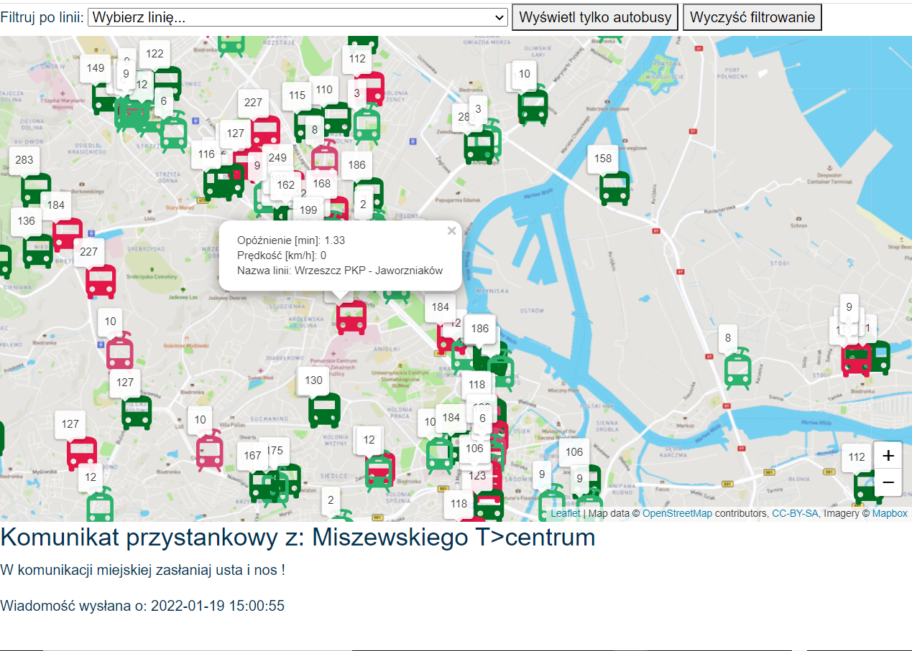
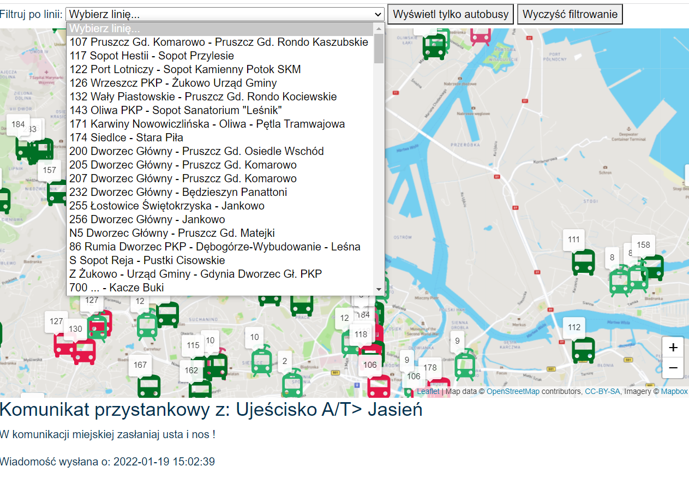
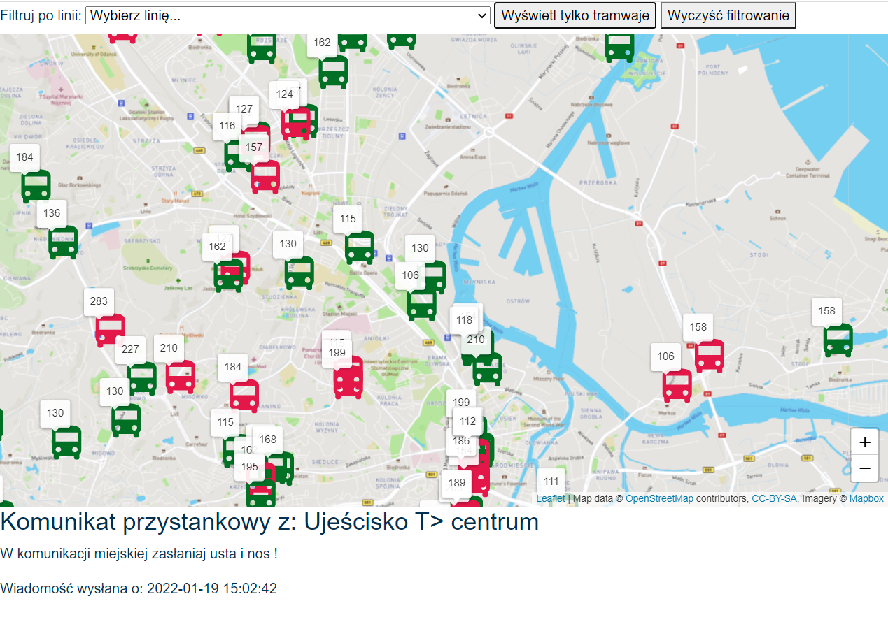
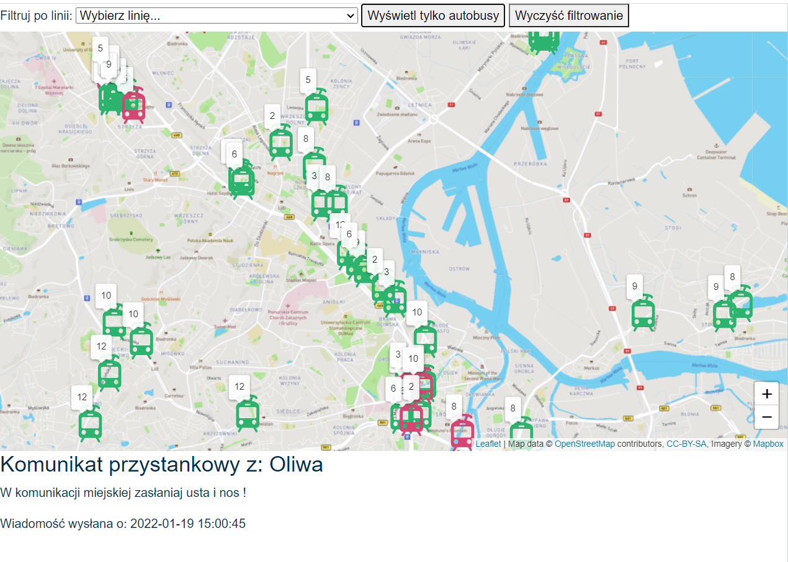

## ZTMForPeople

### University project
### Web application for displaying positions and delays of Gdansk buses and trams

#### The application gets the data from API [Otwarty Gdańsk](https://ckan.multimediagdansk.pl/dataset/tristar)
#### The application is published with the help of GitHub Pages at
[https://ekaterinatrofa.github.io/ZTM4People/](https://ekaterinatrofa.github.io/ZTM4People/)

---

###### Technologies, tools, programming languages: 
- JavaScript
- CSS
- HTML
- [Cypress](https://docs.cypress.io)
- [Mapbox](https://docs.mapbox.com/help/getting-started/)
- [Leaflet](https://leafletjs.com/)
- [geojson](https://geojson.io/)
---

***[Cypress](https://docs.cypress.io)*** is a next generation front end testing tool built for the modern web. 

How to install ***[Cypress](https://docs.cypress.io)*** see here: ***[Install Cypress](https://docs.cypress.io/guides/getting-started/installing-cypress#System-requirements)***

To open cypress ***[Cypress](https://docs.cypress.io)***:
```
npx cypress open
```
For more information see here: ***[Open Cypress](https://docs.cypress.io/guides/getting-started/installing-cypress#Opening-Cypress)***

---
***[Leaflet](https://leafletjs.com/)*** is the leading open-source JavaScript library for mobile-friendly interactive maps. 

How to download ***[Leaflet](https://leafletjs.com/)*** see here: ***[Download Leaflet](https://leafletjs.com/download.html)***

For more information see here: ***[Leaflet](https://leafletjs.com/index.html)***

***GEOJson*** is a format for encoding a variety of geographic data structures.

***[Mapbox](https://docs.mapbox.com/help/getting-started/)*** is a location data platform that powers the maps and location services used in many popular apps. 








Authors:

_Kateryna Trofymenko_, _Kacper Nowak_